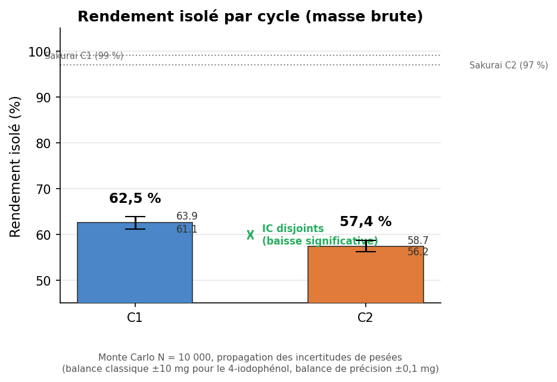
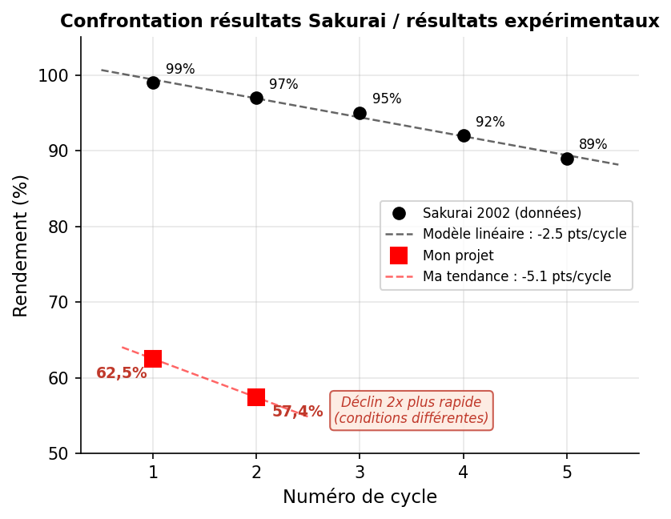
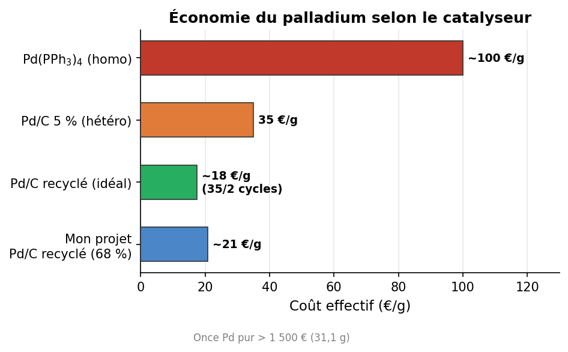
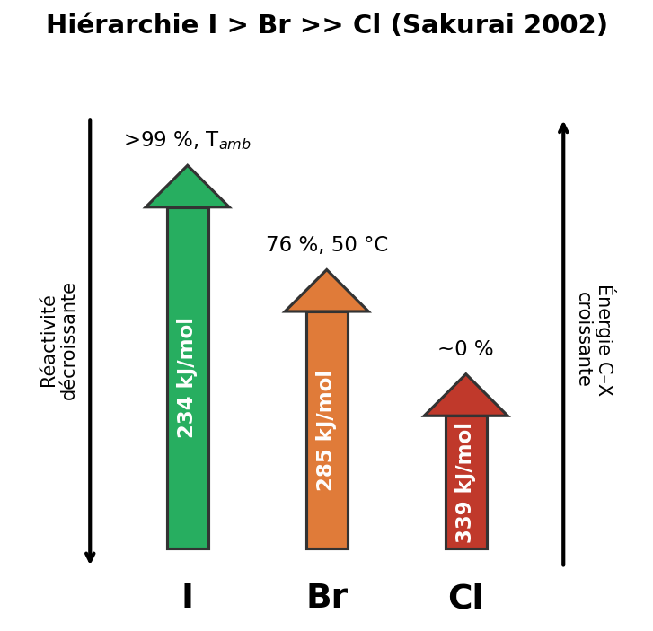
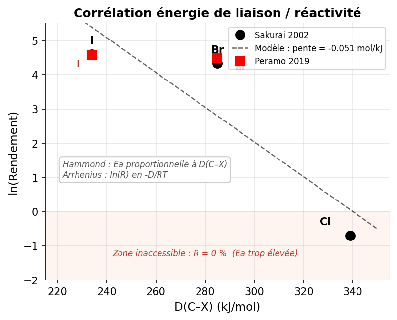

# Projet expérimental de chimie — Recyclage du Pd/C dans le couplage de Suzuki-Miyaura

Ce projet est né d'une expérience menée en laboratoire (2025) : synthèse du
4-hydroxybiphényle par couplage de Suzuki (4-iodophénol + acide
phénylboronique), avec recyclage du catalyseur Pd/C sur 2 cycles. Le code
analyse les incertitudes des résultats (méthode de Monte Carlo) et génère les
figures.

## Setup

```bash
python -m venv .venv
source .venv/bin/activate
pip install -r requirements.txt
```

`rdkit` n'est nécessaire que pour les schémas de molécules (`figures/`) ;
`monte_carlo.py` n'utilise que la bibliothèque standard.

## Usage

```bash
python3 monte_carlo.py             # propagation d'incertitudes + export CSV
python3 tests/test_monte_carlo.py  # vérifications
python3 plot_figures.py            # les 5 graphiques de résultats
```

Les 6 pesées dépendent de deux balances d'incertitudes très différentes
(±10 mg et ±0,1 mg) : plutôt qu'une propagation analytique, `monte_carlo.py`
tire N = 10 000 jeux de masses bruitées et recalcule à chaque tirage rendement
isolé et récupération du Pd/C. La pesée initiale de 4-iodophénol, commune aux
deux cycles, est tirée une seule fois (variables corrélées).

## Results

Rendement isolé C1 = 62,5 ± 1,4 %, C2 = 57,4 ± 1,3 % — intervalles de
confiance à 95 % disjoints : la baisse entre cycles est significative.



Confrontation avec la référence bibliographique (Sakurai 2002, Pd/C sur
5 cycles) : mon déclin est deux fois plus rapide, dans des conditions
différentes.



Le recyclage du Pd/C (récupération 68-71 % par cycle) divise le coût effectif
du palladium :



Réactivité des halogénures d'aryle : la hiérarchie I > Br >> Cl suit l'énergie
de liaison C–X (corrélation type Arrhenius-Hammond) :





## Structure

```
.
├── monte_carlo.py       # propagation d'incertitudes (Monte Carlo, stdlib)
├── plot_figures.py      # graphiques de résultats
├── figures/             # générateurs de schémas (matplotlib, rdkit)
├── tools/               # utilitaires (compression d'images)
├── tests/               # vérifications du calcul
├── assets/              # figures affichées dans ce README
└── output/              # fichiers générés (non versionnés)
```

## Références

- Sakurai, H. et al. — couplage de Suzuki sur Pd/C, 5 cycles de recyclage (2002)
- Peramo, A. et al. — couplage de Suzuki en conditions physiologiques (2019)
